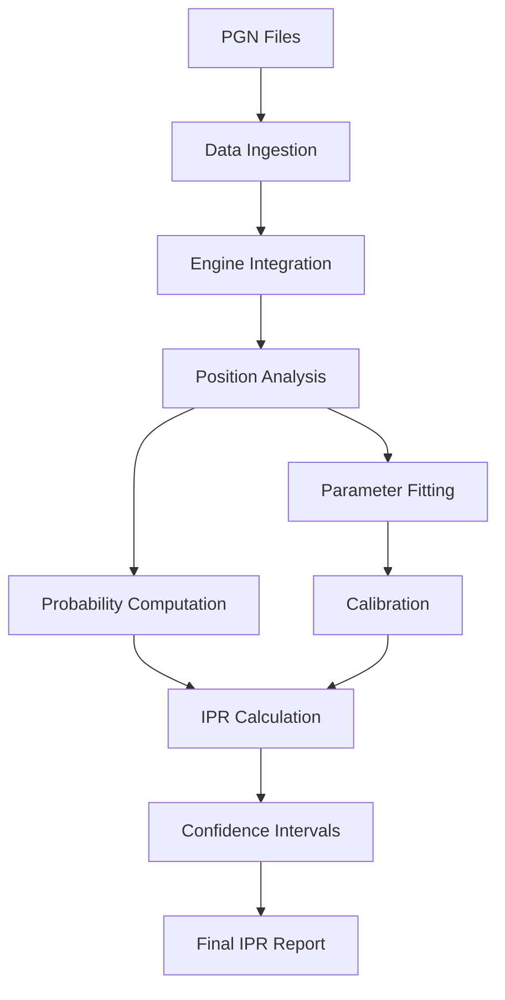

# Intrinsic Performance Rating (IPR) System Architecture

## Overview
This document outlines the program architecture for implementing the Intrinsic Chess Rating (IPR) system as described in the scientific paper. The IPR system evaluates player skill based on move quality using probabilistic modeling of human move selection, calibrated against traditional Elo ratings.

## Core Components

### 1. Data Ingestion Module
**Purpose**: Load and preprocess chess game data from PGN files.

**Responsibilities**:
- Parse PGN files to extract games
- Filter games based on criteria (Elo ratings within ±10 points of century marks, tournament types, time controls)
- Extract positions from games (excluding moves 1-8, positions with >3.00 pawn advantage, repetitions)
- Output: List of analyzed positions with metadata (game info, position FEN, played move)

**Data Flow**:
- Input: PGN files
- Output: PositionData objects (FEN, played_move, game_metadata)

### 2. Engine Integration Module
**Purpose**: Interface with chess engines to evaluate positions.

**Responsibilities**:
- Initialize and manage chess engine (e.g., Stockfish via UCI protocol)
- Send positions to engine for multi-PV analysis (up to 20-50 moves)
- Retrieve evaluations in centipawns for all legal moves
- Handle engine timeouts and errors
- Output: EvaluationData objects (move_evaluations: dict[move: cp_value])

**Data Flow**:
- Input: PositionData (FEN)
- Output: EvaluationData (move: cp dict)

### 3. Position Analysis Module
**Purpose**: Process engine evaluations to compute move quality metrics.

**Responsibilities**:
- Identify best move (v_0 = max evaluation)
- Compute δ_i for each move using logarithmic scaling
- Handle same-sign and opposite-sign cases for δ computation
- Cap number of moves (N=20 or 50) and pad with large δ if needed
- Output: SpreadData objects (δ_vector: list[float], best_move_index: int)

**Mathematical Details**:
- δ_i = |log(1 + v_0) - log(1 + v_i)| when same sign
- δ_i = ∫_{v_i}^{v_0} 1/(1+|z|) dz when opposite signs

**Data Flow**:
- Input: EvaluationData
- Output: SpreadData (δ: list[float])

### 4. Probability Computation Module
**Purpose**: Model human move selection probabilities.

**Responsibilities**:
- For given s, c parameters: compute p_i = exp(-((δ_i/s)**c)) / S_t
- Normalize probabilities to sum to 1
- Compute expected metrics: MMe, AEe, σ_MMe, σ_AEe
- Output: ProbabilityData objects (probabilities: list[float], expected_metrics: dict)

**Mathematical Details**:
- p_i = exp(-((δ_i/s)**c)) / sum_j exp(-((δ_j/s)**c))
- MMe = sum_t p_{0,t}
- AEe = (1/T) * sum_t sum_{i>=1} p_{i,t} * δ_{i,t}

**Data Flow**:
- Input: SpreadData, s, c parameters
- Output: ProbabilityData

### 5. Parameter Fitting Module
**Purpose**: Estimate s and c parameters using percentiling method.

**Responsibilities**:
- Implement grid search over s (0-0.70), c (1-5), q (0-1)
- For each grid point: compute R_{q,s,c} (percentage of "up" tuples)
- Score S_{s,c} = sum_q distance(R_{q,s,c}, q)
- Find optimal (s, c) minimizing S_{s,c}
- Output: FittedParameters (s: float, c: float)

**Data Flow**:
- Input: List of SpreadData with played move indices
- Output: FittedParameters

### 6. Calibration Module
**Purpose**: Calibrate IPR to Elo scale.

**Responsibilities**:
- Fit s, c for each Elo century mark using training data
- Compute AEe on reference set using fitted parameters
- Perform linear regression: IPR = 3571 - 15413 * AEe
- Output: CalibrationModel (slope: float, intercept: float)

**Data Flow**:
- Input: Training data (Elo levels), reference set AEe values
- Output: CalibrationModel

### 7. IPR Calculation Module
**Purpose**: Compute final IPR ratings.

**Responsibilities**:
- Apply fitted s, c to test data to compute AEe
- Use calibration model: IPR = intercept + slope * AEe
- Output: IPRResult (ipr: float, aee: float)

**Data Flow**:
- Input: Test SpreadData, FittedParameters, CalibrationModel
- Output: IPRResult

### 8. Confidence Intervals Module
**Purpose**: Compute statistical confidence for IPR estimates.

**Responsibilities**:
- Compute σ_AEe from test data
- Apply correction factor: σ_a = 1.4 * σ_AEe
- Compute CI: [IPR - 2.8*σ_a, IPR + 2.8*σ_a]
- Output: ConfidenceInterval (lower: float, upper: float)

**Data Flow**:
- Input: IPRResult, test data
- Output: ConfidenceInterval

## Overall Workflow

## Data Structures

### PositionData
- fen: str
- played_move: str (UCI format)
- game_metadata: dict (elo_white, elo_black, event, etc.)

### EvaluationData
- evaluations: dict[str, int]  # move_uci: cp_value

### SpreadData
- deltas: list[float]  # δ_0 to δ_{N-1}
- played_index: int

### ProbabilityData
- probabilities: list[float]
- mme: float
- aee: float
- sigma_mme: float
- sigma_aee: float

### FittedParameters
- s: float
- c: float

### CalibrationModel
- slope: float
- intercept: float

### IPRResult
- ipr: float
- aee: float

### ConfidenceInterval
- lower: float
- upper: float

## Implementation Notes

- **Language**: Python 3.8+
- **Dependencies**: python-chess, numpy, scipy, matplotlib (for visualization)
- **Engine**: Stockfish 15+ with UCI support
- **Performance**: Multi-threading for engine analysis, batch processing for large datasets
- **Assumptions**: Statistical independence of moves, logarithmic perception of centipawns
- **Validation**: Cross-validation on held-out data, comparison with known Elo ratings

## Mathematical Formulas Summary

- δ_i = |ln(1 + v_0) - ln(1 + v_i)| (same sign)
- p_i = exp(-((δ_i/s)^c)) / S_t
- AEe = (1/T) Σ_t Σ_{i≥1} p_{i,t} δ_{i,t}
- IPR = 3571 - 15413 * AEe
- σ_a = 1.4 * σ_AEe

This architecture provides a modular, maintainable framework for implementing the IPR system while allowing for future extensions and optimizations.